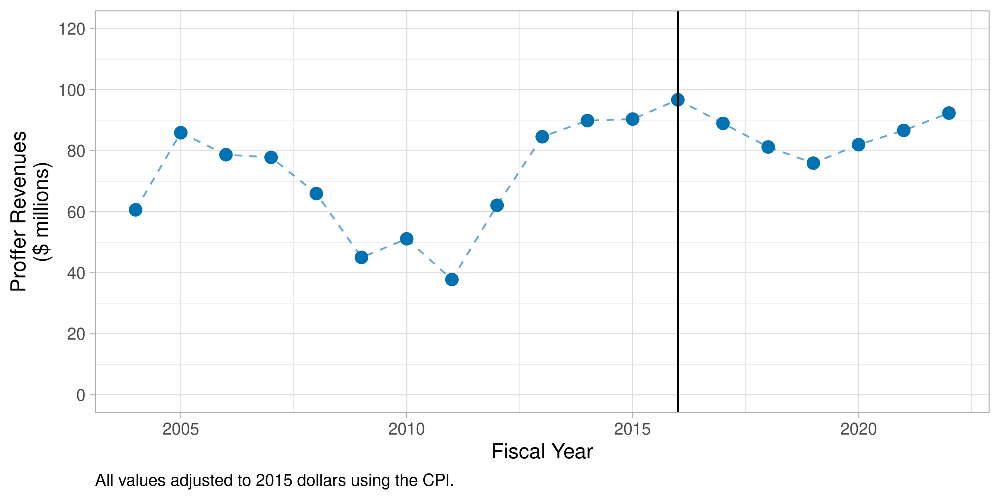
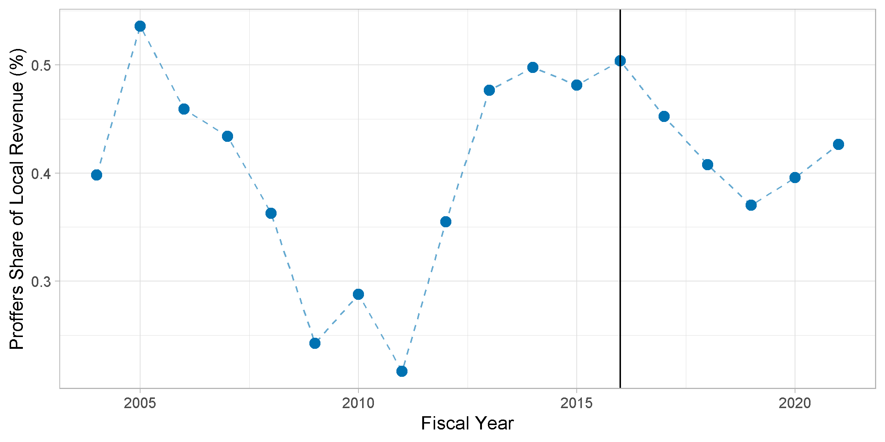

# **Municipal Responses to Zoning Reform:**

### **Evidence from Virginia's Proffer Reform Act of 2016**

---

# Aspirational Abstract
> Statewide zoning reforms may fail to increase housing supply if local governments can respond along unregulated margins. I study the policy response of Virginia municipalities to a 2016 reform that restricted their ability to charge developers for residential upzonings. I find that upzoning is highly price elastic: after the reform, the number of housing units allowed through residential upzonings fell by [X]\%. In counties which were partially exempted from the reform, however, total activity remained constant as localities substituted upzoning from affected to exempt areas. Rather than playing ``whack-a-mole'' with local zoning ordinances, states should directly subsidize the number of newly-permitted housing units to increase housing supply.

---

# Virginia Proffer Reform Act of 2016

Impact fees broadly illegal in VA $\implies$ localities rely on "voluntary" proffers tied to a rezoning application
&nbsp;

In 2016, builders were uphappy with large cash proffers, lobbied state legislature for reform:
- Proffers must address an impact that is *specifically attributable* to the proposed development
- Applies to all **residential** rezoning applications filed after **July 1, 2016**
- Exemptions for parcels near transit in NOVA

---

# Prince William County Suggested Proffers (2015)

### Single Family
| Service | Amount ($)|
|-|-|
|Schools|20,649|
|Parks|5,591|
|Libraries|812|
|Fire and Rescue|1,053|
|Transportation|16,780|
|**Total**|**44,930**

---
# Proffer Administration
- Proffers paid **as building permits are issued** $\implies$ impact on revenues will be gradual
- Amounts are **indexed to inflation**

---

---

---

# Top Proffer Counties (2004-2015)

<!-- html table generated in R 4.3.1 by xtable 1.8-4 package -->
<!-- Wed Aug 23 10:35:41 2023 -->
<table border=1>
<tr> <th>  </th> <th> Rank </th> <th> Name </th> <th> Cash Proffer Revenue </th> <th> Local Revenue </th> <th> Proffer Share (%) </th>  </tr>
  <tr> <td align="right"> 1 </td> <td align="right"> 1 </td> <td> Manassas Park City </td> <td align="right"> 17736580 </td> <td align="right"> 419876799 </td> <td align="right"> 4.2 </td> </tr>
  <tr> <td align="right"> 2 </td> <td align="right"> 2 </td> <td> Loudoun County </td> <td align="right"> 330339589 </td> <td align="right"> 13826110490 </td> <td align="right"> 2.4 </td> </tr>
  <tr> <td align="right"> 3 </td> <td align="right"> 3 </td> <td> Prince William County </td> <td align="right"> 235886628 </td> <td align="right"> 11683218700 </td> <td align="right"> 2.0 </td> </tr>
  <tr> <td align="right"> 4 </td> <td align="right"> 4 </td> <td> Chesterfield County </td> <td align="right"> 88227451 </td> <td align="right"> 7149751515 </td> <td align="right"> 1.2 </td> </tr>
  <tr> <td align="right"> 5 </td> <td align="right"> 5 </td> <td> Goochland County </td> <td align="right"> 4929961 </td> <td align="right"> 535318890 </td> <td align="right"> 0.9 </td> </tr>
  <tr> <td align="right"> 6 </td> <td align="right"> 6 </td> <td> Caroline County </td> <td align="right"> 4442673 </td> <td align="right"> 507613840 </td> <td align="right"> 0.9 </td> </tr>
  <tr> <td align="right"> 7 </td> <td align="right"> 7 </td> <td> Powhatan County </td> <td align="right"> 4566537 </td> <td align="right"> 537986151 </td> <td align="right"> 0.8 </td> </tr>
  <tr> <td align="right"> 8 </td> <td align="right"> 8 </td> <td> Frederick County </td> <td align="right"> 13880061 </td> <td align="right"> 1655135914 </td> <td align="right"> 0.8 </td> </tr>
  <tr> <td align="right"> 9 </td> <td align="right"> 9 </td> <td> Hanover County </td> <td align="right"> 19217590 </td> <td align="right"> 2350289112 </td> <td align="right"> 0.8 </td> </tr>
  <tr> <td align="right"> 10 </td> <td align="right"> 10 </td> <td> Williamsburg City </td> <td align="right"> 3601666 </td> <td align="right"> 468466345 </td> <td align="right"> 0.8 </td> </tr>
   </table>

---

