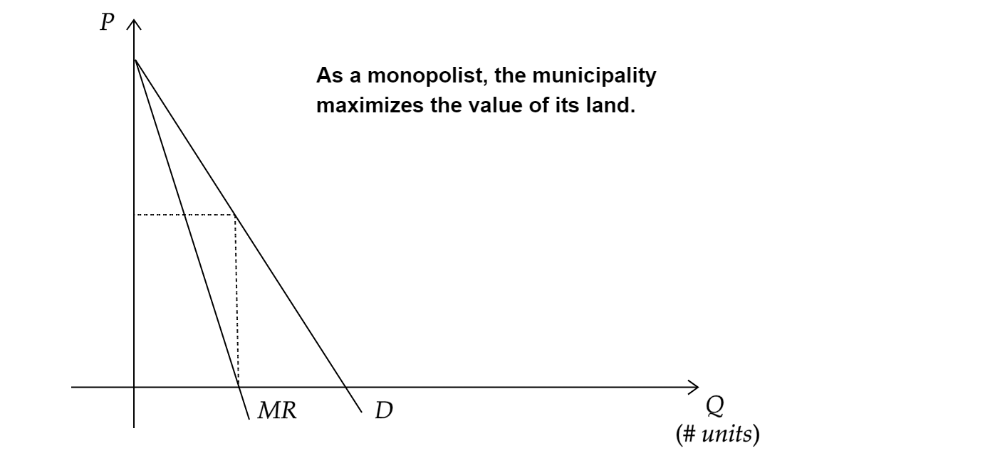
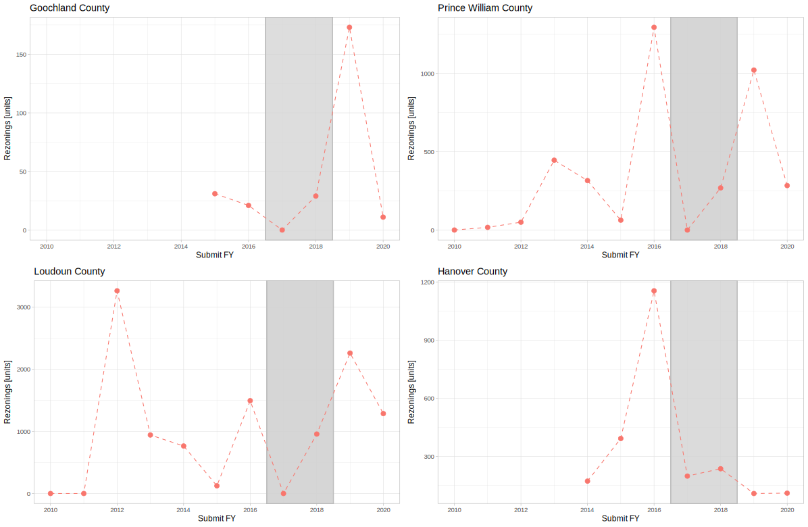

# **Municipal Responses to Zoning Reform:**

### **Evidence from Virginia's Proffer Reform Act of 2016**

---

# Selling the Upzone

---

# Virginia Proffer Reform Act of 2016

VA allows municipalities to collect "voluntary" proffers tied to a rezoning application
&nbsp;

In 2016, developers were uphappy with large cash proffers, lobbied state legislature for reform:
- Proffers must address impacts which are *specifically attributable* to the proposed development $\implies$ **no standard proffer schedule**
- Applies to all **residential** rezoning applications filed after **July 1, 2016**
- Parcel exempt if **high-density** or **near transit** (NOVA)
- Partially unwound in **2019**

---

# Municipality Response

Loudoun, Assistant Director of Planning and Zoning:

> "Where the new legislation applies, we will in fact **not accept cash or offsite proffers**, completely eliminating the discussion or the **potential risk** of the county accepting the unreasonable or wrong types of proffers."

Portsmouth, Planning Director:
> "If you want to submit proffers, **we’re not discussing it**."

Prince William, Board Chairman:
> "We’re stuck,” he said. “That’s why **we haven’t approved a single house** under the new law." (12/6/2018)
> 
---

## Prince William County Suggested Proffers (2014)

|Unit| Service | Amount ($)|
|---|---|---:|
SFD|Schools|20,649|
SFD|Parks & Libraries|6,403|
SFD|Fire and Rescue|1,053|
SFD|Transportation|16,780|
**SFD**|**Total**|**44,930**
**Townhouse**|**Total**|**39,837**
**MFD**|**Total**|**26,778**

---

## A toy model of residential land supply
- municipality acts as **durable goods monopolist**
- an extra unit **decreases** the price of all prior units
- homeowners control **housing supply** through zoning, demand compensation to allow more development
- see [Fischel (2015)](https://www.google.com/books/edition/Zoning_Rules/rRIfswEACAAJ?hl=en)

---

---

---

---

---

---

---
# Discussion
- Reform imposed large **transaction costs** on rezonings (legal uncertainty or "stochastic court enforcement")
- Municipalities respond by halting residential rezonings in 2017
- Some recovery in 2018, possibly related to municipal relationships with developers (in repeated game, developer unlikely to defect) or more legal clarity

---

# What can we learn?
Reduced-form analysis:
- The "elasticity" of residential land use supply

A structural model of municipality behavior:
- Do municipalities act to maximize **average housing prices** or **total land value**? Is there interesting heterogeneity by rural/suburban/urban?
- How much **market power** do municipalities have?
- What are the **welfare effects** of proposed zoning reforms?
  - Mandatory upzoning near transit (e.g., NY Housing Compact, CA SB50)
  - Legal restrictions on proffers/impact fees (e.g., *Koontz v. St. Johns River Water Management District*)

---

# What I Need Help With
- **Empirical Strategy**: DiD is natural method, but no obvious control group
  - Continuous treatment (intensity proportional to pre-reform proffer rates)
  - Would take logs, but many zeros - PPML? **(Looking for a reference)**
- **Models of Land Use**, especially that feature imperfect competition or an upstream regulatory authority
- **How to think about results** given evidence that reform (and its partial repeal) were anticipated
  - Intertemporal substitution of rezoning

---

# Thank you!

---

# Potential Data

|Year|County|Parcel|$a_j$|$p_j$|$q_j$|Type|
|-|-|-|-|-|-|-|
|2016|Fairfax|01|1|$5,000/unit|12|SFD|
|2018|Fairfax|02|0|$3,000/unit|10|MFD|
|2017|Prince William|01|1|$10,000/unit|20|SFD|

where
- $a_j$ indicates whether the application is approved
- $p_j$ is the proffer amount
- $q_j$ is the number of (incremental) allowed units

---

# Old Stuff

---

# Abstract
Statewide zoning reforms may fail to increase housing supply if local governments respond along unregulated margins. I study the policy response of Virginia municipalities to a reform that restricted their ability to charge developers for residential upzonings. I find that the supply of residential land uses is highly price elastic: after the reform, the number of new units allowed by residential upzonings falls by [X]\%. In counties which were partially exempted from the reform, however, aggregate rezoning remains constant as localities substitute from affected to exempt areas. Rather than playing ``whack-a-mole'' with local zoning ordinances, states should subsidize the number of newly-permitted housing units to increase housing supply.

---

# Case Study: Fairfax County

---

---

---

---
# Discussion
Fairfax cares about **proffer revenues** and **total approved units**, not where development occurs.

&nbsp;

Consider state mandated **upzoning near transit** (e.g., NY Housing Compact, CA SB50):
- What happens to total upzoning? Will municipalities substitute away from upzoning other areas?
- What happens to proffer rates and revenues? If supply of buildable land increases, will builders pay less for upzoning?
- What is resident welfare loss?

Need a model!

---

# Poor Man's Model #1
Locality chooses vector $\vec{a}$ of upzonings over parcels $j \in \{1, ..., J\}$ to maximize welfare: 
$$U = \max_{\vec{a}} \sum_{j=1}^J a_jq_j(p_j + v_{j}) - C\left(\sum_{j=1}^Ja_jq_j\right)$$

where 
- $p_j$ is proffer amount,
- $v_{j}$ is idiosyncratic value of upzoning parcel $j$,
- $q_j$ is number of approved units, and
- $C(\cdot)$ is a disutility function with $C'(\cdot) > 0$

---

# Optimal Upzoning
Optimum characterized by $J$ inequalities: 
$$a_j = 1 \iff q_j(p_j + v_{j}) > C(q_j + Q_{-j}) - C(Q_{-j})$$

Assume $v_j \sim N(0, \sigma^2)$ and parameterize $C(q) = ...$.

### Assumptions
- Ignores dynamics (upzoning is irreversible)
- Hard (impossible?) to know value of in-kind proffers (e.g., land dedication, road improvements), which will load into $v_j$
- Locality may have market power $\implies$ $p_j$ is endogenous to $\vec{a}$
- Collapses heterogeneity in zoning codes to single dimension ($q_j$)

---

# Appendix

---

# Proffer Administration
- Proffers often paid out **as building permits are issued** $\implies$ reform's impact on revenues will be **gradual**, especially for single family dwellings
- Payments **indexed to CPI/PPI (!)**

---

---

---

### Top Proffer Counties (2004-2015)

<!-- html table generated in R 4.2.1 by xtable 1.8-4 package -->
<!-- Wed Aug 23 15:39:50 2023 -->
<table border=1>
<tr> <th> Rank </th> <th> Name </th> <th> Proffer Revenue Share (%) </th>  </tr>
  <tr> <td align="right"> 1 </td> <td> Manassas Park City </td> <td align="right"> 4.2 </td> </tr>
  <tr> <td align="right"> 2 </td> <td> Loudoun County </td> <td align="right"> 2.4 </td> </tr>
  <tr> <td align="right"> 3 </td> <td> Prince William County </td> <td align="right"> 2.0 </td> </tr>
  <tr> <td align="right"> 4 </td> <td> Chesterfield County </td> <td align="right"> 1.2 </td> </tr>
  <tr> <td align="right"> 5 </td> <td> Goochland County </td> <td align="right"> 0.9 </td> </tr>
  <tr> <td align="right"> 6 </td> <td> Caroline County </td> <td align="right"> 0.9 </td> </tr>
  <tr> <td align="right"> 7 </td> <td> Powhatan County </td> <td align="right"> 0.8 </td> </tr>
  <tr> <td align="right"> 8 </td> <td> Frederick County </td> <td align="right"> 0.8 </td> </tr>
  <tr> <td align="right"> 9 </td> <td> Hanover County </td> <td align="right"> 0.8 </td> </tr>
  <tr> <td align="right"> 10 </td> <td> Williamsburg City </td> <td align="right"> 0.8 </td> </tr>
   </table>
