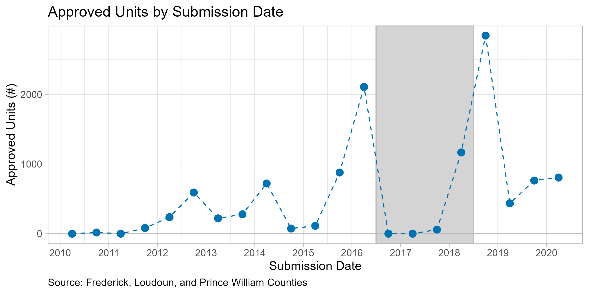

# Proffer Reform
Presenting at the labor/public workshop clarified what I would need to show in order to proceed with this project.

### How and why did the reform affect proffer negotiations?
Interviewing Mike Vanderpool, a real estate attorney in Prince William and Manassas, to get more context (playing phone tag currently).

### What is the right model?
In the presentation, I described the reform as "an unspecified price ceiling on proffers." Lee pointed out that the impact of a price ceiling on quantity is ambiguous. Under imperfect competition, it could **increase** the supply of residential land (c.f. minimum wage / monopsony).

Despite the evidence of intertemporal substitution around the reform, rezonings in general appear to trend upwards, especially after 2018.

## Impacts on Prices
I use a synthetic difference-in-differences method to estimate the effect of the reform on housing prices. I first classify Virginia counties into three groups based on the share of proffers in their own-source revenues in 2016. Counties with an above-average proffer share are "high proffer," those with below-average are "low proffer," and those with zero proffer revenues are "no proffer". Summary statistics are reported below.

<!-- html table generated in R 4.2.1 by xtable 1.8-4 package -->
<!-- Mon Oct 16 10:55:43 2023 -->
<table border=1>
<caption align="bottom"> Summary Statistics </caption>
<tr> <th>  </th> <th> Variable </th> <th> High Proffer </th> <th> Low Proffer </th> <th> No Proffer </th>  </tr>
  <tr> <td align="right"> 1 </td> <td> Number of Counties </td> <td> 16 </td> <td> 7 </td> <td> 16 </td> </tr>
  <tr> <td align="right"> 2 </td> <td> Population </td> <td> 193,666 </td> <td> 102,335 </td> <td> 96,270 </td> </tr>
  <tr> <td align="right"> 3 </td> <td>  </td> <td> (256,504) </td> <td> (139,236) </td> <td> (98,226) </td> </tr>
  <tr> <td align="right"> 4 </td> <td> Zillow HVI ($) </td> <td> 312,557 </td> <td> 271,315 </td> <td> 239,983 </td> </tr>
  <tr> <td align="right"> 5 </td> <td>  </td> <td> (86,518) </td> <td> (103,535) </td> <td> (158,555) </td> </tr>
  <tr> <td align="right"> 6 </td> <td> Local Revenue ($/capita) </td> <td> NA </td> <td> NA </td> <td> NA </td> </tr>
  <tr> <td align="right"> 7 </td> <td>  </td> <td> (NA) </td> <td> (NA) </td> <td> (NA) </td> </tr>
  <tr> <td align="right"> 8 </td> <td> Proffer Revenue ($/capita) </td> <td> NA </td> <td> NA </td> <td> NA </td> </tr>
  <tr> <td align="right"> 9 </td> <td>  </td> <td> (NA) </td> <td> (NA) </td> <td> (NA) </td> </tr>
  <tr> <td align="right"> 10 </td> <td> Building Permits (Single-Family) </td> <td> 667 </td> <td> 237 </td> <td> 144 </td> </tr>
  <tr> <td align="right"> 11 </td> <td>  </td> <td> (654) </td> <td> (216) </td> <td> (188) </td> </tr>
  <tr> <td align="right"> 12 </td> <td> Building Permits (Multi-Family) </td> <td> 197 </td> <td> 116 </td> <td> 194 </td> </tr>
  <tr> <td align="right"> 13 </td> <td>  </td> <td> (339) </td> <td> (225) </td> <td> (395) </td> </tr>
   </table>

I then estimate the effect of the reform on housing prices separately for each group using Zillow's Home Value Index (ZHVI). I construct the synthetic control from all counties in the continental US outside of Virginia. Results are depicted below.

I estimate a statistically significant decline in housing prices of 5% in high proffer counties. This effect appears by 2019 and persists through Covid. A 5% decrease is roughly consistent with a 1:1 pass-through of proffers to housing prices: the average ZHVI in treated counties is ~$300k, so 5% is $15k, which is comparable to the average proffer in the pre-reform period. The literature suggests that housing demand is relatively inelastic, so a 1:1 pass-through is plausible.

The result is robust to ending the sample in 2019 and to using a repeat-sale index instead of ZHVI.

The impact on prices is delayed, suggesting that it is a consequence of both the 2016 reform and the 2019 update. The combination appears to have caused a persistent decline in proffer amounts without a corresponding decline in the supply of residential land. 

Impacts on low proffer and no proffer counties in VA are smaller and not statistically significant, suggesting that the decline is related to proffer legislation and not caused by a statewide trend.

## Next Steps
- [ ] **Talk to Mike Vanderpool**
- [ ] Summary statistics separately for high, low, and no proffer counties
- [ ] Check for substitution from single-family to multi-family construction, consistent with an Alchien-Allen effect (per-unit tax encourages consumption of high-quality good). Some anecdotal evidence of this in the press.
- [ ] Estimate reform impacts on building permits
- [ ] Plot per-unit proffer amounts over time (collect data or estimate as aggregate revenue divided by permits)

---

### Other Updates
- Bike lane project is dead. Thinking about other potential collaborations on questions related to transportation infrastructure.
- Submitting a grant requests to GSASC for $300 to get foot traffic data for a new idea related to how (1) heterogeneity in preferences and (2) work-from-home affect congestion of consumption amenities. The idea is that if everyone prefers to dine on Friday, shop on Saturday, and exercise on Sunday, then those amenities will be crowded and their prices will be higher because the fixed land rent must be borne by fewer consumers. Plan is to check for reduced-form correlations between foot traffic dispersion and local characteristics (e.g., rents, diversity, WFH), and then, if something pops up, to write down a model.

